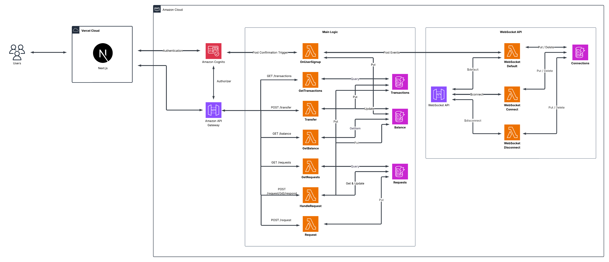

# 💳 LambdaPay

**A modern, serverless payment platform built with AWS Lambda, Next.js, and DynamoDB.**

[](https://serverless.com)
[](https://nextjs.org)
[](https://aws.amazon.com)
[](LICENSE)

## 🚀 Overview

LambdaPay is a fully serverless payment application that enables users to transfer money, request payments, and manage their balance in real-time. Built with modern web technologies and AWS serverless architecture, it provides a secure, scalable, and cost-effective solution for digital payments.

### ✨ Key Features

- **💰 Instant Transfers**: Send money to other users instantly
- **📩 Payment Requests**: Request money from other users with optional messages
- **📊 Transaction History**: View all your payment history
- **🔄 Real-time Updates**: Live notifications via WebSocket connections
- **🔐 Secure Authentication**: AWS Cognito integration with email verification
- **🎁 Welcome Bonus**: New users receive $20 welcome bonus
- **📱 Responsive Design**: Modern UI with dark/light theme support

## 🏗️ Architecture



### 🔧 Technology Stack

**Frontend:**
- Next.js 15 with App Router
- React 19 with TypeScript
- Tailwind CSS + shadcn/ui components
- AWS Amplify for authentication
- Real-time WebSocket connections

**Backend:**
- AWS Lambda (Node.js 20.x)
- API Gateway with Cognito authorizer
- DynamoDB for data persistence
- WebSocket API for real-time features
- AWS SDK v3

**Infrastructure:**
- Serverless Framework for IaC
- AWS Cognito for user management
- CloudFormation for resource provisioning

## 📁 Project Structure

```
LambdaPay/
├── 📁 frontend2/              # Next.js frontend application
│   ├── 📁 app/               # Next.js app router pages
│   │   ├── 📁 auth/          # Authentication pages
│   │   ├── 📁 dashboard/     # Main dashboard
│   │   ├── 📁 requests/      # Payment requests
│   │   └── 📁 transactions/  # Transaction history
│   ├── 📁 components/        # Reusable UI components
│   │   └── 📁 ui/           # shadcn/ui components
│   ├── 📁 lib/              # Utility functions and configs
│   └── 📁 hooks/            # Custom React hooks
├── 📁 lambda/                # AWS Lambda functions
│   ├── 📁 handlers/         # Lambda function handlers
│   │   └── 📁 websocket/    # WebSocket handlers
│   └── 📁 utils/            # Shared utilities
├── 📄 serverless.yml        # Serverless configuration
├── 📄 package.json          # Backend dependencies
└── 📄 README.md             # This file
```

## 🚀 Getting Started

### Prerequisites

- Node.js 20.x or later
- AWS CLI configured
- Serverless Framework CLI
- pnpm (recommended) or npm

### 🔨 Installation

1. **Clone the repository:**
   ```bash
   git clone https://github.com/MaxKappa/lambdapay.git
   cd lambdapay
   ```

2. **Install backend dependencies:**
   ```bash
   npm install
   ```

3. **Install frontend dependencies:**
   ```bash
   cd frontend2
   pnpm install
   ```

4. **Configure environment variables:**
   
   Create `.env.local` in the `frontend2` directory:
   ```env
   NEXT_PUBLIC_API_BASE_URL=https://your-api-gateway-url
   NEXT_PUBLIC_AMPLIFY_USERPOOL_ID=your-cognito-pool-id
   NEXT_PUBLIC_AMPLIFY_WEBCLIENT_ID=your-cognito-client-id
   NEXT_PUBLIC_AMPLIFY_IDENTITYPOOL_ID=your-identity-pool-id
   ```

### 🚀 Deployment

1. **Deploy the backend:**
   ```bash
   serverless deploy
   ```

2. **Deploy the frontend:**
   ```bash
   cd frontend2
   pnpm build
   # Deploy to Vercel or your preferred platform
   ```

### 🏃‍♂️ Local Development

1. **Start the frontend development server:**
   ```bash
   cd frontend2
   pnpm dev
   ```

2. **For backend development:**
   ```bash
   serverless offline
   ```

## 📊 API Endpoints

### Authentication Required (Cognito JWT)

| Method | Endpoint | Description |
|--------|----------|-------------|
| `GET` | `/balance` | Get user balance |
| `GET` | `/transactions` | Get transaction history |
| `POST` | `/transfer` | Transfer money to another user |
| `GET` | `/requests` | Get payment requests |
| `POST` | `/request` | Request money from another user |
| `POST` | `/request/{id}/respond` | Accept/reject payment request |

### WebSocket Events

| Event | Description |
|-------|-------------|
| `TRANSACTION` | New transaction notification |
| `REQUEST` | New payment request |
| `BALANCE_UPDATE` | Balance change notification |

## 🗄️ Database Schema

### DynamoDB Tables

**Balance Table:**
- `userId` (String, Primary Key)
- `balance` (Number, in cents)

**Transactions Table:**
- `userId` (String, Partition Key)
- `transactionId` (String, Sort Key)
- `type` (String): "SENT" | "RECEIVED"
- `amount` (Number, in cents)
- `timestamp` (String, ISO date)
- `otherUserId` (String)
- `otherUsername` (String)

**Requests Table:**
- `requestId` (String, Primary Key)
- `fromUserId` (String, GSI)
- `toUserId` (String, GSI)
- `amount` (Number, in cents)
- `status` (String): "PENDING" | "ACCEPTED" | "REJECTED"
- `message` (String, optional)
- `timestamp` (String, ISO date)

**Connections Table:**
- `connectionId` (String, Primary Key)
- `userId` (String)
- `connectedAt` (String, ISO date)
- `ttl` (Number, TTL attribute)

## 🔐 Security Features

- **Authentication**: AWS Cognito with email verification
- **Authorization**: JWT token validation on all endpoints
- **Input Validation**: Comprehensive validation for all API inputs
- **Rate Limiting**: AWS API Gateway built-in rate limiting
- **CORS**: Properly configured CORS policies
- **Encryption**: Data encrypted at rest in DynamoDB
- **Amount Limits**: Maximum transfer/request limits enforced

## 🎨 UI Components

The frontend uses a modern component library built with:
- **shadcn/ui**: High-quality, accessible components
- **Tailwind CSS**: Utility-first CSS framework
- **Radix UI**: Unstyled, accessible components
- **Lucide React**: Beautiful icons
- **React Hook Form**: Form state management
- **Zod**: Schema validation

## 📱 Features in Detail

### 💸 Money Transfers
- Instant transfers between users
- Real-time balance updates
- Transaction history tracking
- Input validation and security checks

### 📋 Payment Requests
- Request money with optional messages
- Accept/reject functionality
- Status tracking (pending, accepted, rejected)
- Real-time notifications

### 🔄 Real-time Features
- WebSocket connections for live updates
- Automatic reconnection handling
- Real-time balance updates
- Instant notification system

### 🎁 Welcome Bonus
- New users receive $20 (2000 cents) welcome bonus
- Automatic account setup on registration
- Triggered via Cognito PostConfirmation

## 🚀 Performance & Scalability

- **Serverless Architecture**: Auto-scaling based on demand
- **DynamoDB**: NoSQL database with millisecond latency
- **CDN**: Static assets served via CDN
- **Code Splitting**: Optimized bundle sizes
- **Lazy Loading**: Components loaded on demand

## 🤝 Contributing

1. Fork the repository
2. Create a feature branch (`git checkout -b feature/amazing-feature`)
3. Commit your changes (`git commit -m 'Add some amazing feature'`)
4. Push to the branch (`git push origin feature/amazing-feature`)
5. Open a Pull Request

## 📝 License

This project is licensed under the MIT License - see the [LICENSE](LICENSE) file for details.

## 🙏 Acknowledgments

- Built with [Serverless Framework](https://serverless.com)
- UI components from [shadcn/ui](https://ui.shadcn.com)
- Icons from [Lucide](https://lucide.dev)
- Hosted on [AWS](https://aws.amazon.com) and [Vercel](https://vercel.com)

---

<div align="center">
  <p>Made with ❤️ for the Cloud Computing Technologies course</p>
  <p>Università degli Studi di Milano</p>
</div>